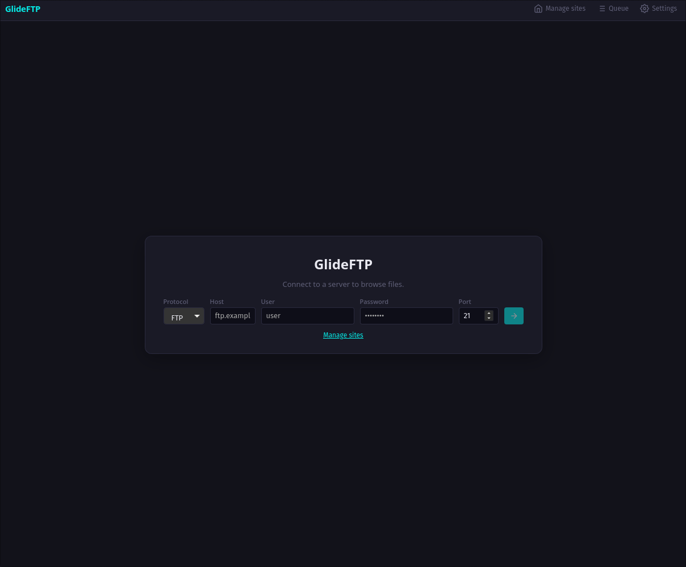
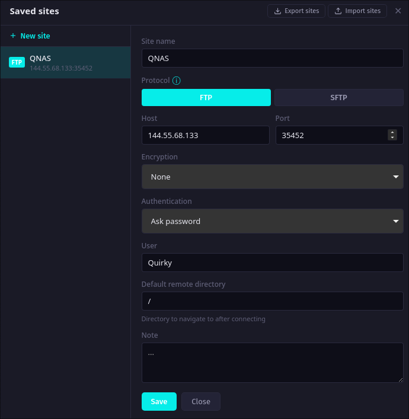
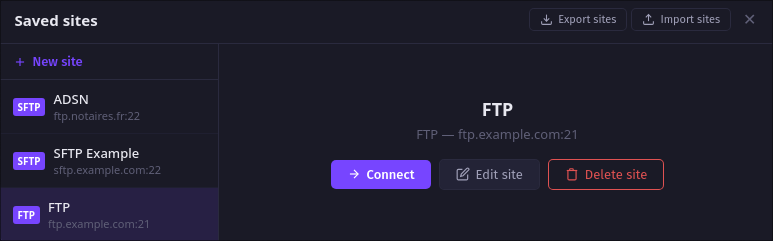
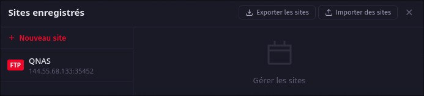
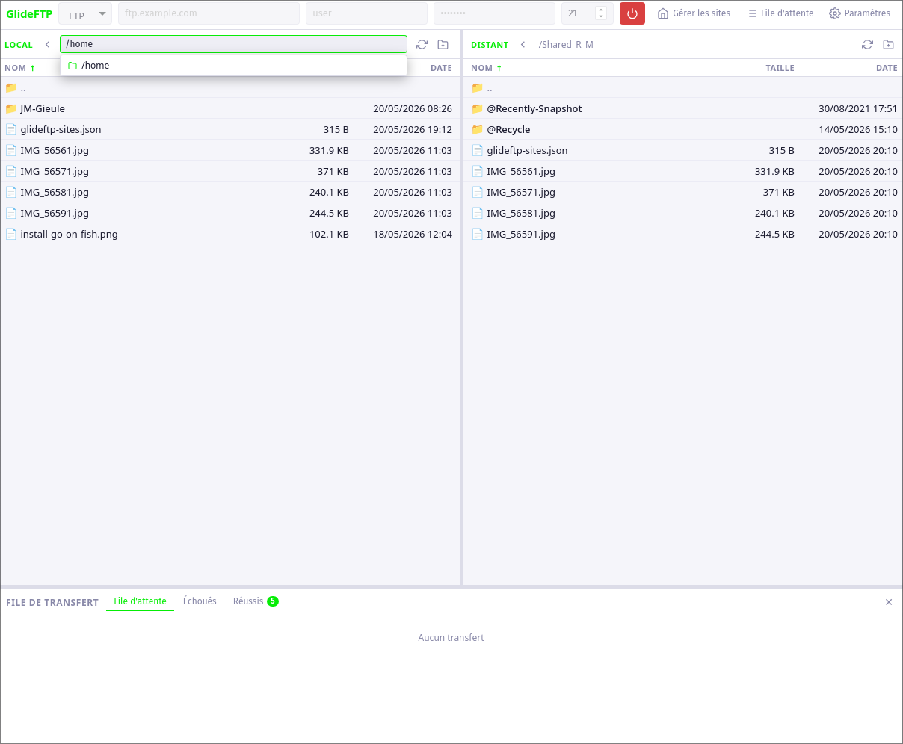
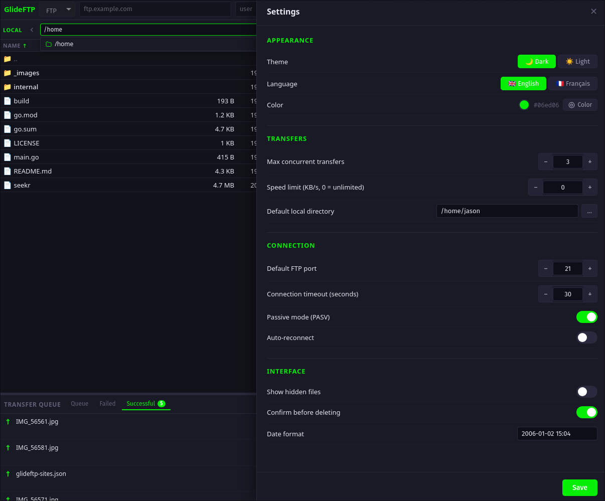
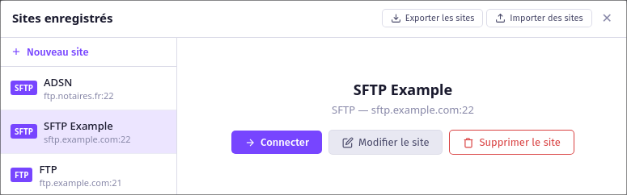
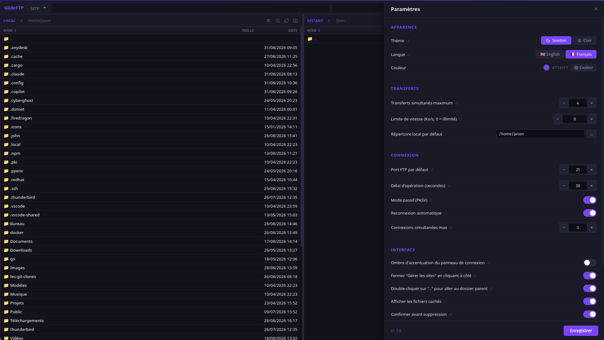

# GlideFTP

  

---

<table style="text-align:center;">  
  <tr>  
    <th colspan="3" style="text-align:center;">🇬🇧 Prerequisites / 🇫🇷 Prérequis</th>  
  </tr>  
  <tr>  
    <th style="text-align:center;">Ubuntu / Debian (22.04+)</th>  
    <th style="text-align:center;">Fedora</th>  
    <th style="text-align:center;">Arch Linux</th>  
  </tr>  
  <tr>  
    <td style="text-align:center;"><code>sudo apt install libwebkit2gtk-4.1-0</code></td>  
    <td style="text-align:center;"><code>sudo dnf install webkit2gtk4.1</code></td>  
    <td style="text-align:center;"><code>sudo pacman -S webkit2gtk-4.1</code></td>  
  </tr>  
</table>  

---

## 🇬🇧 English

**GlideFTP** is a free, open-source desktop FTP/SFTP client built with [Go](https://go.dev/) and [Wails v2](https://wails.io/), featuring a modern [Svelte](https://svelte.dev/) interface. It is designed to be fast, lightweight, and compatible with both **Windows** and **Linux**.  

### Features

- **FTP & SFTP support** - connect to any FTP or SFTP server
- **SSH key authentication** - supports OpenSSH key files, PuTTY `.ppk` format (v2/v3, RSA & Ed25519), interactive auth, and SSH agent
- **Dark & Light themes** - dark by default, switchable in settings
- **Custom accent color** - full RGB/HEX color picker to personalize the interface
- **English & French interface** - English by default, switchable in settings
- **Dual-panel file browser** - local files on the left, remote files on the right; toggle per panel between flat list view and hierarchical tree view (lazy-loaded, files visible with size indicator; double-click or arrow button to transfer)
- **Recursive folder transfers** - drag-and-drop or queue an entire folder for upload/download; the whole tree is walked and transferred file by file
- **Intra-panel copy/cut/paste** - Ctrl+C/X/V or right-click to copy, move, or duplicate files within the same panel (local-to-local or remote-to-remote)
- **Transfer queue** - with 3 tabs: pending, failed, and successful transfers; cancel in-progress transfers
- **Sound notifications** - optional sound alert (4 built-in tones, previewable) when a batch of transfers finishes; configurable in settings
- **Multi-file operations** - select multiple files with Ctrl+click, Shift+click, or rubber-band drag; transfer or delete the whole selection at once
- **Multi-connection tabs** - open several servers simultaneously; browser-style tabs appear between the toolbar and file panels; configurable limit (1-5) in settings
- **Quick connect** - reconnect or open an additional connection straight from the toolbar without going through the Site Manager
- **Site manager** - save, edit and quickly reconnect to your favorite servers; add notes to each site; reorder sites by drag-and-drop; duplicate a site in one click; selective export (choose which sites to include); export/import as JSON or encrypted `.gfe`
- **Native Linux packages** - available as `.deb` (Debian/Ubuntu), `.rpm` (Fedora/RHEL), and on the AUR (`glideftp-bin`) for Arch Linux; automatic releases via GitHub Actions on each version tag
- **Secure password storage** - passwords are stored in the OS keyring (gnome-keyring/kwallet on Linux, Windows Credential Manager on Windows), never in plain text on disk
- **Ask-password auth** - password is never saved; prompted at connect time
- **SFTP auto-coupling** - selecting SFTP automatically sets authentication to Interactive (or SSH Key) and vice versa
- **Path autocomplete** - dropdown suggestions while typing in the path bar
- **Smart local paths** - the local path bar expands `~`, `$VAR`/`${VAR}` (Linux) and `%VAR%` (Windows) environment variables
- **Full settings panel** - passive mode, timeout, concurrent transfers, speed limit, hidden files; export/import all settings as a JSON file to back up or transfer your configuration
- **Encryption support** - None, TLS (implicit), FTPES (explicit)
- **System trash on delete** - deleting a local file sends it to the OS trash (Linux: XDG Trash spec; Windows: Recycle Bin) rather than permanently deleting it
- **Connection keepalive** - a NOOP/ping is sent every 60 seconds to prevent the server from dropping idle connections; unexpected disconnects trigger a notification and automatic UI update

### Screenshots

|Main|Saved sites|
|----|-----|
|  |  |

|SFTP|Sites|
|----|-----------|
|  |  |

|Connected|Settings|
|---------|--------|
|  |  |

### Download pre-built binaries

| File | Platform | Notes |
|---|---|---|
| `GlideFTP-Windows-vX.Y.Z.tar.gz` / `.tar` | Windows | Requires WebView2 (built into Windows 10/11) |
| `GlideFTP-Linux-vX.Y.Z.tar.gz` / `.tar` | Linux binary | Requires `libwebkit2gtk-4.1` - see below |
| `GlideFTP-Linux-Debian-AppImage-vX.Y.Z.tar.gz` / `.tar` | Linux AppImage - **Debian/Ubuntu** | **Recommended** - self-contained, Ubuntu 22.04+ / Debian 12+ |
| `GlideFTP-Linux-Arch-AppImage-vX.Y.Z.tar.gz` / `.tar` | Linux AppImage - **Arch** | For Arch / modern Fedora |
| `GlideFTP-Linux-vX.Y.Z.deb` | Debian / Ubuntu | `sudo apt install ./GlideFTP-Linux-vX.Y.Z.deb` |
| `GlideFTP-Linux-vX.Y.Z.rpm` | Fedora / RHEL | `sudo dnf install GlideFTP-Linux-vX.Y.Z.rpm` |
| AUR: `glideftp-bin` | Arch Linux | `yay -S glideftp-bin` |

#### Linux - pre-built binary

The raw Linux binary dynamically links against `libwebkit2gtk-4.1`. If it is not installed on your system, the binary will refuse to start with a *"cannot open shared object file"* error. Install it first:

```bash
# Ubuntu / Debian (22.04+)
sudo apt install libwebkit2gtk-4.1-0

# Fedora
sudo dnf install webkit2gtk4.1

# Arch Linux
sudo pacman -S webkit2gtk-4.1
```

Then make it executable and run it:

```bash
chmod +x GlideFTP
./GlideFTP
```

#### Linux - password storage (keyring)

GlideFTP stores passwords in the **system keyring** (gnome-keyring or kwallet). These are usually pre-installed on major desktop environments. If the keyring daemon is not running, a warning banner appears in the Site Manager and passwords will not be saved (use "Ask password" auth instead).  

To check whether a keyring daemon is available:

```bash
pgrep -f gnome-keyring-daemon || pgrep -f kwalletd6 || echo "no keyring daemon found"
or
pacman -Qs gnome-keyring ; pacman -Qs kwallet
```

To install one if missing:

```bash
# Arch Linux - GNOME Keyring (recommended for non-KDE environments)
sudo pacman -S gnome-keyring

# Arch Linux - KWallet (for KDE/Plasma)
sudo pacman -S kwallet

# Ubuntu / Debian
sudo apt install gnome-keyring

# Fedora
sudo dnf install gnome-keyring
```

#### Linux - AppImage (recommended)

Two AppImage variants are provided - both are fully self-contained (no system library to install):

| Variant | File | Compatible with |
|---|---|---|
| **Debian/Ubuntu** ✓ recommended | `GlideFTP-Linux-Debian-AppImage-vX.Y.Z.*` | Ubuntu 22.04+, Debian 12+, Arch, and any distro with GLIBC 2.35+ |
| **Arch** | `GlideFTP-Linux-Arch-AppImage-vX.Y.Z.*` | Arch, modern Fedora (GLIBC 2.43+) |

If you are unsure which one to pick, use the **Debian/Ubuntu** variant - it runs on the widest range of distributions.  

> **Check your GLIBC version:** `ldd --version` (first line shows the version number)

```bash
# Debian/Ubuntu variant (recommended)
chmod +x GlideFTP-Debian-x86_64.AppImage
./GlideFTP-Debian-x86_64.AppImage

# Arch variant
chmod +x GlideFTP-Arch-x86_64.AppImage
./GlideFTP-Arch-x86_64.AppImage
```

# Build from source

### Prerequisites

- [Go](https://go.dev/dl/) 1.21+
- [Node.js](https://nodejs.org/) 18+
- [Wails v2](https://wails.io/docs/gettingstarted/installation)

```bash
go install github.com/wailsapp/wails/v2/cmd/wails@latest
export PATH="$PATH:$(go env GOPATH)/bin"
```

On **Linux**, the WebKit2GTK **development** package is required to compile:

```bash
# Arch Linux
sudo pacman -S webkit2gtk-4.1

# Ubuntu / Debian (22.04+)
sudo apt install libwebkit2gtk-4.1-dev

# Fedora
sudo dnf install webkit2gtk4.1-devel
```

### Build

```bash
git clone https://github.com/Quirky1869/GlideFTP.git
cd GlideFTP
```

**Using the build script (recommended):**  

```bash
./make.sh                    # all: Linux binary + Windows exe + AppImages + .deb + .rpm
./make.sh linux              # Linux binary only    → build/bin/linux/GlideFTP
./make.sh windows            # Windows exe only     → build/bin/windows/GlideFTP.exe
./make.sh appimage-arch      # Arch AppImage        → build/bin/linux/GlideFTP-Arch-x86_64.AppImage
./make.sh appimage-debian    # Debian/Ubuntu AppImage → build/bin/linux/GlideFTP-Debian-x86_64.AppImage
./make.sh deb 1.7.6          # .deb package         → build/bin/linux/GlideFTP-Linux-v1.7.6.deb
./make.sh rpm 1.7.6          # .rpm package         → build/bin/linux/GlideFTP-Linux-v1.7.6.rpm
./make.sh -h                 # show all targets and options
```

> `appimage` requires `curl`/`wget` (downloads `linuxdeploy` on first run, cached in `tools/`) and `imagemagick`.  
> `appimage-debian`, `deb`, and `rpm` require **Docker** or **Podman**.

**Manual commands:**  

```bash
# Linux (requires webkit2gtk-4.1)
wails build -tags webkit2_41

# Windows cross-compile from Linux (requires mingw-w64-gcc)
# Install on Arch : sudo pacman -S mingw-w64-gcc
CC=x86_64-w64-mingw32-gcc CGO_ENABLED=1 GOOS=windows wails build -platform windows/amd64
```

> **Note:** Windows uses WebView2 (built into Windows 10/11), so the `-tags webkit2_41` flag is not needed for Windows builds.

### Run

```bash
# Linux binary
./build/bin/linux/GlideFTP

# Linux AppImage - Debian/Ubuntu variant (recommended)
./build/bin/linux/GlideFTP-Debian-x86_64.AppImage

# Linux AppImage - Arch variant
./build/bin/linux/GlideFTP-Arch-x86_64.AppImage

# Windows
build\bin\windows\GlideFTP.exe
```

### Releases

Releases are available [here](https://github.com/Quirky1869/GlideFTP/releases)  

### Tech Stack

| Layer | Technology |
|---|---|
| Backend | Go - FTP (`jlaffaye/ftp`), SFTP (`pkg/sftp`, `x/crypto/ssh`) |
| UI Framework | Wails v2 |
| Frontend | Svelte + Vite |
| Config storage | JSON files in OS user config directory |

---

## 🇫🇷 Français

**GlideFTP** est un client FTP/SFTP de bureau gratuit et open-source, développé avec [Go](https://go.dev/) et [Wails v2](https://wails.io/), doté d'une interface moderne en [Svelte](https://svelte.dev/). Il est conçu pour être rapide, léger, et compatible avec **Windows** et **Linux**.  

### Fonctionnalités

- **Support FTP & SFTP** - connexion à n'importe quel serveur FTP ou SFTP
- **Authentification par clé SSH** - fichiers OpenSSH, format PuTTY `.ppk` (v2/v3, RSA & Ed25519), auth interactive, et SSH agent
- **Thèmes sombre & clair** - sombre par défaut, modifiable dans les paramètres
- **Couleur d'accentuation personnalisable** - sélecteur de couleur RGB/HEX pour personnaliser l'interface
- **Interface en anglais & français** - anglais par défaut, modifiable dans les paramètres
- **Explorateur double panneau** - fichiers locaux à gauche, fichiers distants à droite ; basculez par panneau entre la vue liste et une vue arborescente hiérarchique (chargement paresseux, fichiers visibles avec indicateur de taille ; double-clic ou bouton flèche pour transférer)
- **Transferts de dossiers récursifs** - glissez-déposez ou mettez en file un dossier entier pour l'upload/download ; toute l'arborescence est parcourue et transférée fichier par fichier
- **Copier/couper/coller intra-panneau** - Ctrl+C/X/V ou clic droit pour copier, déplacer ou dupliquer des fichiers au sein d'un même panneau (local vers local ou distant vers distant)
- **File de transfert** - avec 3 onglets : en attente, échoués et réussis ; annulation des transferts en cours
- **Notifications sonores** - alerte sonore optionnelle (4 sons intégrés, avec écoute préalable) une fois qu'un lot de transferts est terminé ; configurable dans les paramètres
- **Opérations multi-fichiers** - sélection multiple avec Ctrl+clic, Shift+clic ou sélection à la souris ; transfert ou suppression de toute la sélection en une fois
- **Onglets multi-connexion** - ouvrez plusieurs serveurs simultanément ; des onglets style navigateur apparaissent entre la barre d'outils et les panneaux de fichiers ; limite configurable (1 à 5) dans les paramètres
- **Connexion rapide** - reconnectez-vous ou ouvrez une connexion supplémentaire directement depuis la barre d'outils, sans passer par le Gestionnaire de sites
- **Gestionnaire de sites** - enregistrez, modifiez et reconnectez-vous rapidement à vos serveurs favoris ; ajoutez des notes à chaque site ; réorganisez les sites par glisser-déposer ; dupliquez un site en un clic ; export sélectif (choisissez quels sites inclure) ; exportez/importez en JSON ou en `.gfe` chiffré
- **Paquets Linux natifs** - disponible en `.deb` (Debian/Ubuntu), `.rpm` (Fedora/RHEL), et sur l'AUR (`glideftp-bin`) pour Arch Linux ; releases automatisées via GitHub Actions à chaque tag de version
- **Stockage sécurisé des mots de passe** - les mots de passe sont stockés dans le keyring système (gnome-keyring/kwallet sur Linux, Gestionnaire de mots de passe Windows), jamais en clair sur le disque
- **Auth demande de mot de passe** - le mot de passe n'est jamais enregistré ; saisi au moment de la connexion
- **Couplage automatique SFTP** - sélectionner SFTP active automatiquement l'authentification Interactive (ou Clé SSH) et inversement
- **Autocomplétion de chemin** - suggestions dans la barre de chemin lors de la saisie
- **Chemins locaux intelligents** - la barre de chemin local développe `~`, `$VAR`/`${VAR}` (Linux) et `%VAR%` (Windows)
- **Panneau de paramètres complet** - mode passif, délai de connexion, transferts simultanés, limite de vitesse, fichiers cachés ; export/import de tous les paramètres en fichier JSON pour sauvegarder ou transférer votre configuration
- **Support du chiffrement** - Aucun, TLS (implicite), FTPES (explicite)
- **Corbeille système à la suppression** - la suppression d'un fichier local l'envoie dans la corbeille de l'OS (Linux : spec XDG Trash ; Windows : Corbeille) plutôt que de le supprimer définitivement
- **Keepalive de connexion** - un NOOP/ping est envoyé toutes les 60 secondes pour éviter qu'un serveur coupe une connexion inactive ; une déconnexion inattendue affiche une notification et met à jour l'interface automatiquement

### Screenshots

|Main|Sites Sauvegardés|
|:----:|:-----:|
|  |  |

|SFTP|Sites|
|:----:|:-----------:|
|  |  |

|Connecté|Paramètres|
|:---------:|:--------:|
|  |  |

### Télécharger les binaires pré-compilés

| Fichier | Plateforme | Notes |
|---|---|---|
| `GlideFTP-Windows-vX.Y.Z.tar.gz` / `.tar` | Windows | Nécessite WebView2 (intégré à Windows 10/11) |
| `GlideFTP-Linux-vX.Y.Z.tar.gz` / `.tar` | Binaire Linux | Nécessite `libwebkit2gtk-4.1` - voir ci-dessous |
| `GlideFTP-Linux-Debian-AppImage-vX.Y.Z.tar.gz` / `.tar` | AppImage Linux - **Debian/Ubuntu** | **Recommandé** - autonome, Ubuntu 22.04+ / Debian 12+ |
| `GlideFTP-Linux-Arch-AppImage-vX.Y.Z.tar.gz` / `.tar` | AppImage Linux - **Arch** | Pour Arch / Fedora récente |
| `GlideFTP-Linux-vX.Y.Z.deb` | Debian / Ubuntu | `sudo apt install ./GlideFTP-Linux-vX.Y.Z.deb` |
| `GlideFTP-Linux-vX.Y.Z.rpm` | Fedora / RHEL | `sudo dnf install GlideFTP-Linux-vX.Y.Z.rpm` |
| AUR : `glideftp-bin` | Arch Linux | `yay -S glideftp-bin` |

#### Linux - binaire pré-compilé

Le binaire Linux est lié dynamiquement à `libwebkit2gtk-4.1`. Si cette bibliothèque n'est pas installée sur votre système, le binaire refusera de démarrer avec une erreur *"cannot open shared object file"*. Installez-la d'abord :

```bash
# Ubuntu / Debian (22.04+)
sudo apt install libwebkit2gtk-4.1-0

# Fedora
sudo dnf install webkit2gtk4.1

# Arch Linux
sudo pacman -S webkit2gtk-4.1
```

Rendez ensuite le binaire exécutable et lancez-le :

```bash
chmod +x GlideFTP
./GlideFTP
```

#### Linux - stockage des mots de passe (keyring)

GlideFTP stocke les mots de passe dans le **keyring système** (gnome-keyring ou kwallet). Ces démons sont généralement pré-installés sur les environnements de bureau courants. Si aucun démon keyring n'est actif, une bannière d'avertissement s'affiche dans le Gestionnaire de sites et les mots de passe ne seront pas enregistrés (utilisez l'auth "Demander le mot de passe" à la place).  

Pour vérifier si un démon keyring est disponible :

```bash
pgrep -f gnome-keyring-daemon || pgrep -f kwalletd6 || echo "aucun démon keyring trouvé"
ou
pacman -Qs gnome-keyring ; pacman -Qs kwallet
```

Pour en installer un si nécessaire :

```bash
# Arch Linux - GNOME Keyring (recommandé hors KDE)
sudo pacman -S gnome-keyring

# Arch Linux - KWallet (pour KDE/Plasma)
sudo pacman -S kwallet

# Ubuntu / Debian
sudo apt install gnome-keyring

# Fedora
sudo dnf install gnome-keyring
```

#### Linux - AppImage (recommandé)

Deux variantes d'AppImage sont disponibles - toutes deux sont entièrement autonomes (aucune bibliothèque système à installer) :

| Variante | Fichier | Compatible avec |
|---|---|---|
| **Debian/Ubuntu** ✓ recommandée | `GlideFTP-Linux-Debian-AppImage-vX.Y.Z.*` | Ubuntu 22.04+, Debian 12+, Arch, et toute distro avec GLIBC 2.35+ |
| **Arch** | `GlideFTP-Linux-Arch-AppImage-vX.Y.Z.*` | Arch, Fedora récente (GLIBC 2.43+) |

En cas de doute, choisissez la variante **Debian/Ubuntu** - elle est compatible avec le plus grand nombre de distributions.  

> **Vérifier votre version de GLIBC :** `ldd --version` (la première ligne indique le numéro de version)

```bash
# Variante Debian/Ubuntu (recommandée)
chmod +x GlideFTP-Debian-x86_64.AppImage
./GlideFTP-Debian-x86_64.AppImage

# Variante Arch
chmod +x GlideFTP-Arch-x86_64.AppImage
./GlideFTP-Arch-x86_64.AppImage
```

# Compiler depuis les sources

### Prérequis

- [Go](https://go.dev/dl/) 1.21+
- [Node.js](https://nodejs.org/) 18+
- [Wails v2](https://wails.io/docs/gettingstarted/installation)

```bash
go install github.com/wailsapp/wails/v2/cmd/wails@latest
export PATH="$PATH:$(go env GOPATH)/bin"
```

Sur **Linux**, le paquet de **développement** WebKit2GTK est nécessaire pour compiler :

```bash
# Arch Linux
sudo pacman -S webkit2gtk-4.1

# Ubuntu / Debian (22.04+)
sudo apt install libwebkit2gtk-4.1-dev

# Fedora
sudo dnf install webkit2gtk4.1-devel
```

### Compiler

```bash
git clone https://github.com/Quirky1869/GlideFTP.git
cd GlideFTP
```

**Via le script de build (recommandé) :**  

```bash
./make.sh                    # tout : binaire Linux + exe Windows + AppImages + .deb + .rpm
./make.sh linux              # Linux seulement       → build/bin/linux/GlideFTP
./make.sh windows            # Windows seulement     → build/bin/windows/GlideFTP.exe
./make.sh appimage-arch      # AppImage Arch         → build/bin/linux/GlideFTP-Arch-x86_64.AppImage
./make.sh appimage-debian    # AppImage Debian/Ubuntu → build/bin/linux/GlideFTP-Debian-x86_64.AppImage
./make.sh deb 1.7.6          # paquet .deb           → build/bin/linux/GlideFTP-Linux-v1.7.6.deb
./make.sh rpm 1.7.6          # paquet .rpm           → build/bin/linux/GlideFTP-Linux-v1.7.6.rpm
./make.sh -h                 # afficher toutes les cibles et options
```

> `appimage` nécessite `curl`/`wget` (télécharge `linuxdeploy` au premier run, mis en cache dans `tools/`) et `imagemagick`.  
> `appimage-debian`, `deb` et `rpm` nécessitent **Docker** ou **Podman**.

**Commandes manuelles :**  

```bash
# Linux (nécessite webkit2gtk-4.1)
wails build -tags webkit2_41

# Cross-compilation Windows depuis Linux (nécessite mingw-w64-gcc)
# Installation sur Arch : sudo pacman -S mingw-w64-gcc
CC=x86_64-w64-mingw32-gcc CGO_ENABLED=1 GOOS=windows wails build -platform windows/amd64
```

> **Note :** Windows utilise WebView2 (intégré à Windows 10/11), le flag `-tags webkit2_41` n'est donc pas nécessaire pour les builds Windows.

### Lancer

```bash
# Binaire Linux
./build/bin/linux/GlideFTP

# AppImage Linux - variante Debian/Ubuntu (recommandée)
./build/bin/linux/GlideFTP-Debian-x86_64.AppImage

# AppImage Linux - variante Arch
./build/bin/linux/GlideFTP-Arch-x86_64.AppImage

# Windows
build\bin\windows\GlideFTP.exe
```

### Releases

Les [releases](https://github.com/Quirky1869/GlideFTP/releases) sont disponibles [ici](https://github.com/Quirky1869/GlideFTP/releases)  

### Stack technique

| Couche | Technologie |
|---|---|
| Backend | Go - FTP (`jlaffaye/ftp`), SFTP (`pkg/sftp`, `x/crypto/ssh`) |
| Framework UI | Wails v2 |
| Frontend | Svelte + Vite |
| Stockage config | Fichiers JSON dans le répertoire de config utilisateur |

---

Developed by [Quirky](https://github.com/Quirky1869)  
